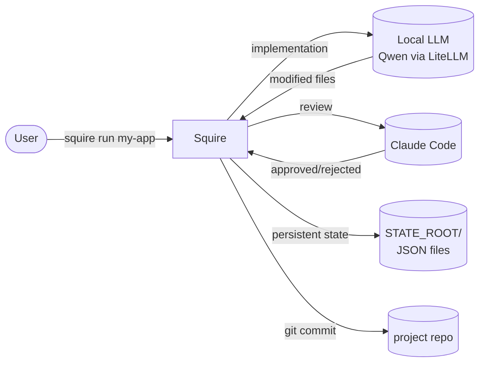

# Squire

[🇧🇷 Português](README.md) · 🇬🇧 English

> A **two-tier orchestrator** that pairs a local LLM (implementation) with
> Claude Code (review) to run software projects semi-autonomously, with a
> target ratio of **30 local calls for every 1 Claude Code call**.



## What is it?

Squire is a CLI that drives a software project from start to finish:

- Reads a list of tasks (`tasks.json`).
- For each task, a **cheap local LLM** implements and runs the tests.
- When tests pass, **Claude Code** reviews from above — approves or returns
  structured feedback.
- Approved → automatic commit; rejected → back to the local LLM with the
  feedback in hand.
- Everything persisted as JSON: you can stop / resume / inspect at any time.

The two-tier choice exists to **optimize cost without sacrificing
engineering quality**. The local LLM handles repetitive grunt work;
Claude Code handles judgment.

## Quickstart

```bash
# 1. Create a new project (pointing to an existing or new git repo)
$ squire new my-app --repo /home/me/projects/my-app --stack typescript

# 2. Edit the tasks (or ask Claude to plan them)
$ squire tasks plan my-app --desc "REST API for managing todos"

# 3. Run
$ squire run my-app
```

For background execution, crash recovery, dry-run mode, see
[`docs/en/cli.md`](docs/en/cli.md).

## Full documentation

### Concepts
- [Architecture](docs/en/architecture.md) — the two-tier model, components, flow
- [Tasks](docs/en/tasks.md) — JSON schema, lifecycle, TDD, effort
- [Backends](docs/en/backends.md) — LiteLLM, OpenCode, Crush (and deprecated aider)
- [Homologation](docs/en/homologation.md) — mechanical gate, technical escalation, loop detection
- [Viking Pattern](docs/en/viking-pattern.md) — per-domain restrictions per project

### Operations
- [CLI](docs/en/cli.md) — complete reference of all subcommands
- [Configuration](docs/en/configuration.md) — env vars, files, precedence
- [Cost and Budget](docs/en/cost-and-budget.md) — USD tracking + caps
- [State and Recovery](docs/en/state-and-recovery.md) — checkpoint, lock, recovery flows

### Diagnostics
- [Troubleshooting](docs/en/troubleshooting.md) — common problems + fixes

## Requirements

- **Python 3.11+** (Pydantic v2, modern syntax)
- **Claude Code CLI** (`claude --print --output-format json`)
- **At least one coding backend:**
  - [LiteLLM](https://docs.litellm.ai/) + local model (Qwen, etc.) — recommended
  - [opencode](https://opencode.ai) CLI
  - [crush](https://github.com/charmbracelet/crush) CLI
- **Git** in the project repo (squire does auto-commits)
- `bash`, `jq`, `gh` (the latter for the upcoming PR automation feature)

## Repository structure

```text
squire/
├── README.md              ← Portuguese (primary)
├── README.en.md           ← this file
├── CLAUDE.md              ← project briefing for Claude Code
├── squire                 ← bash CLI wrapper (frontend)
├── squire.py              ← main loop
├── inner_loop.py          ← one local-agent iteration
├── backends.py            ← LiteLLM / OpenCode / Crush
├── homologator.py         ← Claude review + technical escalation
├── rate_limiter.py        ← call-count + USD budget
├── checkpoint.py          ← atomic write + lock
├── models.py              ← Pydantic v2 schemas
├── config.py              ← env vars + price table
├── viking.py              ← per-domain restriction loader
├── progress.py            ← progress.txt generator
├── tasks_cli.py           ← `squire tasks` subcommands
├── tests/                 ← pytest
└── docs/                  ← documentation
    └── en/                ← English mirror (this language)
```

## License and contribution

(TBD. Add here when publishing.)

## Roadmap

Upcoming features are planned in `/home/ai-debian/.claude/plans/` (agent
state, outside the repo). Highlights: branch + PR automation, codebase RAG
via Qdrant, structured homologation output, live dashboard via JSONL events,
gate caching, multi-project via worktrees.
