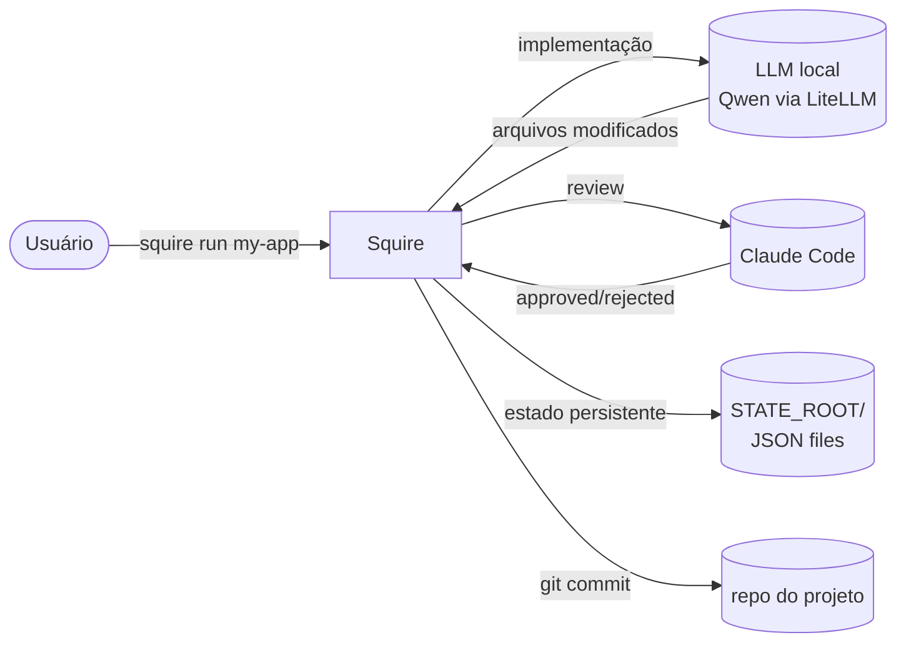

# Squire

🇧🇷 Português · [🇬🇧 English](README.en.md)

> Um **orquestrador de dois tiers** que coordena um LLM local (implementação)
> com o Claude Code (revisão) para executar projetos de software de forma
> semi-autônoma, com proporção-alvo de **30 chamadas locais para 1 do
> Claude Code**.



## O que é?

Squire é um CLI que toca um projeto de software do início ao fim:

- Lê uma lista de tasks (`tasks.json`).
- Para cada task, um **LLM local barato** implementa e roda os testes.
- Quando os testes passam, o **Claude Code** revisa de cima — aprova ou
  devolve feedback.
- Aprovado, commit automático; rejeitado, volta para o LLM local com o
  feedback estruturado.
- Tudo persistido em JSON: você pode parar/retomar/inspecionar a qualquer
  momento.

A escolha de dois tiers existe para **otimizar custo sem sacrificar
qualidade de engenharia**. O LLM local é responsável pelo trabalho
braçal repetitivo; o Claude Code, pelo julgamento.

## Quickstart

```bash
# 1. Criar um projeto novo (apontando para um repo git existente ou novo)
$ squire new my-app --repo /home/me/projects/my-app --stack typescript

# 2. Editar as tasks (ou pedir o Claude para planejar)
$ squire tasks plan my-app --desc "API REST para gerenciar tarefas"

# 3. Rodar
$ squire run my-app
```

Para opções de execução em background, retomar após crash, ou rodar em
modo dry-run, veja [`docs/cli.md`](docs/cli.md).

## Documentação completa

### Conceitos
- [Arquitetura](docs/arquitetura.md) — o modelo dos dois tiers, componentes, fluxo
- [Tasks](docs/tasks.md) — schema JSON, lifecycle, TDD, effort
- [Backends](docs/backends.md) — LiteLLM, OpenCode, Crush (e o aider deprecated)
- [Homologação](docs/homologacao.md) — gate mecânico, escalação técnica, loop detection
- [Padrão Viking](docs/padrao-viking.md) — restrições de domínio por projeto

### Operação
- [CLI](docs/cli.md) — referência completa de todos os subcomandos
- [Configuração](docs/configuracao.md) — env vars, arquivos, precedência
- [Custos e orçamento](docs/custos-e-orcamento.md) — tracking USD + caps
- [Estado e recuperação](docs/estado-e-recuperacao.md) — checkpoint, lock, recovery flows

### Diagnóstico
- [Troubleshooting](docs/troubleshooting.md) — problemas comuns + fixes

## Requisitos

- **Python 3.11+** (Pydantic v2, syntax moderno)
- **Claude Code CLI** (`claude --print --output-format json`)
- **Ao menos um backend de coding:**
  - [LiteLLM](https://docs.litellm.ai/) + modelo local (Qwen, etc.) — recomendado
  - [opencode](https://opencode.ai) CLI
  - [crush](https://github.com/charmbracelet/crush) CLI
- **Git** no repo do projeto (squire faz auto-commit)
- `bash`, `jq`, `gh` (este último para o futuro de PR automation)

## Estrutura do repositório

```text
squire/
├── README.md              ← este arquivo
├── README.en.md           ← versão em inglês
├── CLAUDE.md              ← briefing do projeto para o Claude Code
├── squire                 ← CLI bash wrapper (frontend)
├── squire.py              ← loop principal
├── inner_loop.py          ← uma iteração do agente local
├── backends.py            ← LiteLLM / OpenCode / Crush
├── homologator.py         ← review pelo Claude + escalação técnica
├── rate_limiter.py        ← call-count + USD budget
├── checkpoint.py          ← escrita atômica + lock
├── models.py              ← Pydantic v2 schemas
├── config.py              ← env vars + tabela de preços
├── viking.py              ← carga de restrições por domínio
├── progress.py            ← geração de progress.txt
├── tasks_cli.py           ← subcomandos `squire tasks`
├── tests/                 ← pytest
└── docs/                  ← documentação (esta pasta)
    └── en/                ← mirror em inglês
```

## Licença e contribuição

(Em definição. Adicione aqui quando publicar.)

## Roadmap

Próximas features estão planejadas em `/home/ai-debian/.claude/plans/`
(estado do agente, fora do repo). Os destaques: branch + PR automation,
codebase RAG via Qdrant, structured homologation output, live dashboard
via JSONL events, gate caching, multi-projeto com worktrees.
