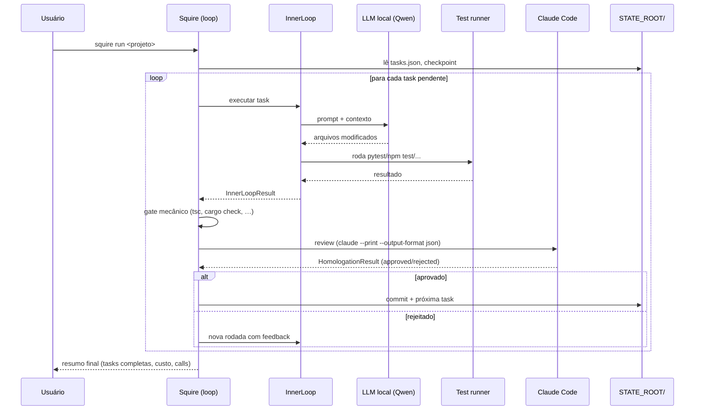
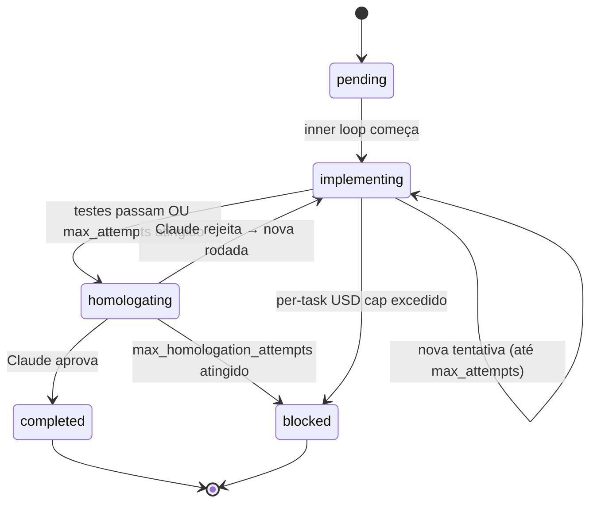

# Arquitetura

🇧🇷 Português · [🇬🇧 English](en/architecture.md)

Squire é um **orquestrador de dois tiers** que coordena um LLM local (implementação)
com o Claude Code (revisão), executando projetos de software de forma
semi-autônoma. Este documento explica o modelo conceitual: quem faz o quê,
por que dois tiers, e como o filesystem funciona como memória externalizada.

## Sumário

- [Os dois tiers](#os-dois-tiers)
- [Componentes](#componentes)
- [Ciclo de uma task](#ciclo-de-uma-task)
- [Filesystem como memória externalizada](#filesystem-como-memória-externalizada)
- [Insights de design](#insights-de-design)

## Os dois tiers



**Tier 1 — Execução (LLM local).** Roda no Zordon via [LiteLLM](https://docs.litellm.ai/)
expondo um Qwen 35B local. É o cavalo de carga: implementa, refatora, corrige.
Custo marginal próximo de zero por chamada; throughput ~124 tok/s.

**Tier 2 — Supervisão (Claude Code).** Invocado via `claude --print
--output-format json` para fazer review de engenharia de alto nível: o código
resolve o que a task pede? Tem edge cases? Segue padrões do projeto? Custa
~1000× mais por chamada que o tier 1, então a meta é proporção **30 chamadas
locais para 1 do Claude Code**.

## Componentes

| Arquivo                | Responsabilidade                                                        |
| ---------------------- | ----------------------------------------------------------------------- |
| `squire.py`            | Loop principal, ciclo de rodadas, contabilidade de custos               |
| `inner_loop.py`        | Uma iteração: instrução → backend → testes → resultado                   |
| `backends.py`          | LiteLLM, OpenCode, Crush — implementações do `CodingBackend`            |
| `homologator.py`       | Invoca Claude Code para review + escalação técnica (`unblock`, `implement_directly`) |
| `rate_limiter.py`      | Window-based call count + USD budget diário                             |
| `checkpoint.py`        | Escrita atômica + session lock + load/save dos modelos Pydantic         |
| `models.py`            | Schemas Pydantic v2: Task, Checkpoint, GlobalStats, TokenUsage, …       |
| `config.py`            | Env vars, tabela de preços, paths, helpers de custo                     |
| `viking.py`            | Carga de `<repo>/docs/viking/*.md` (restrições por domínio)              |
| `progress.py`          | Geração/leitura de `progress.txt` (memória de longo prazo)              |
| `tasks_cli.py`         | Subcomandos `squire tasks` (list/add/edit/rm/split/plan)                |
| `squire` (bash)        | Front-end CLI: dispatcha subcomandos, gerencia bg/lock/log              |

> **Insight:** o boundary entre `squire.py` e `inner_loop.py` é importante.
> Inner loop não conhece homologação, rate limit, nem custos — sabe só
> "rodar uma iteração e devolver resultado". Toda decisão de continuar/escalar/
> commitar é do `Squire`. Isso permite trocar o backend (`litellm` → `opencode`)
> ou adicionar uma fase RED sem mudar o orquestrador.

### Squire Dashboard como segundo escritor

O squire-dashboard (Next.js, ler `docs/configuracao.md`) é normalmente um
leitor — faz polling dos JSONs em `SQUIRE_DATA_PATH`. A partir do P3 ele
também escreve, mas só fora do path crítico do `Squire`:

- `POST /api/alerts/ack` — marca alerta como `acknowledged` ou remove
  do `alerts.json`.
- `POST /api/projects/<id>/budget` — patch em `Checkpoint.rate_limit.max_daily_usd`
  ou `max_calls_per_window`.
- `POST /api/projects/<id>/tasks/<task-id>/action` — `retry` zera
  tentativas/rejeições, `approve` força aprovação, `skip` liga
  `skip_homologation`.

Todas as mutações passam por `writeJsonAtomic` (`.tmp` → `rename`), o mesmo
padrão de `checkpoint.atomic_write_json`. Antes de mutar, a rota lê
`session.lock` — se um squire estiver rodando o projeto-alvo, responde
409 e o operador espera a sessão liberar. Squire continua sendo o único
escritor enquanto está executando; o dashboard só edita entre sessões.

## Ciclo de uma task



Cada transição é persistida em `checkpoint.json` antes de avançar — se squire
crashar no meio, `squire resume` reposiciona o cursor exatamente onde parou.
Os status do enum `TaskStatus` ([`models.py:25`](../models.py)) são: `pending`,
`implementing`, `testing`, `homologating`, `completed`, `blocked`.

Em paralelo ao status da task, o `Cursor` ([`models.py:175`](../models.py))
rastreia o `CursorStep` corrente dentro de uma rodada: `planning`, `red_phase`
(TDD: escrita de testes antes da implementação), `llm_execution`, `testing`,
`homologation`, `completed`.

### O que acontece dentro de uma rodada

1. **Snapshot de testes** (TDD) — antes da implementação, `InnerLoop.snapshot_test_hashes`
   ([`inner_loop.py:72`](../inner_loop.py)) calcula SHA256 de cada `test_*.py`.
   Após a execução, `check_test_integrity` compara; se um teste foi modificado,
   o squire reverte via `git checkout` e devolve erro para o LLM.
2. **Fase RED** (se `task.tdd=True`) — escreve testes falhos. Pode ser feita pelo
   Claude (`test_author=claude`, default) ou pelo LLM local (`test_author=local`).
3. **Inner loop** — até `max_attempts` (default 10) tentativas:
   monta instrução, chama backend, roda testes. A cada 5 falhas, pede
   ajuda técnica ao Claude Code (`TechnicalEscalation.unblock`).
4. **Gate mecânico** — antes de gastar uma call ao Claude Code,
   `_pre_homologation_checks` ([`squire.py:567`](../squire.py)) roda
   typecheckers/compiladores por linguagem (tsc, cargo check, mvn compile,
   go build, etc.) e detecta padrões anti-vibe-coding (`any`, `# type: ignore`,
   `unsafe`, `catch unreachable`). Falha → volta para o inner loop sem
   consumir budget.
5. **Homologação** — `Homologator.review` ([`homologator.py:63`](../homologator.py))
   envia código + contexto para o Claude Code, recebe `HomologationResult`.
   Aprovado: commit + próxima task. Rejeitado: feedback realimenta o inner loop.
6. **Escalações automáticas** — loop detectado (mesmo erro em N rejeições
   consecutivas), nenhum arquivo modificado em N ciclos, ou penúltima rodada
   com loop → Claude implementa diretamente via `implement_directly`.

Veja [Homologação](homologacao.md) para o detalhe completo dessa máquina.

## Filesystem como memória externalizada

O squire não confia no contexto da sessão para estado de longo prazo. Tudo o
que precisa sobreviver a um crash/restart mora em `$SQUIRE_STATE_ROOT/`:

```text
$SQUIRE_STATE_ROOT/
├── session.lock            ← lock global (PID + TTL)
├── budget.json             ← caps USD configurados via `squire budget set`
├── global-stats.json       ← custo/tokens/calls agregados do dia
├── alerts.json             ← alertas críticos
└── projects/
    └── <project-id>/
        ├── project.json    ← metadata do projeto
        ├── tasks.json      ← backlog
        ├── checkpoint.json ← cursor + rate limit state + recovery hints
        ├── history.json    ← eventos da sessão (auditoria)
        └── progress.txt    ← memória de longo prazo (resumo das tasks
                              concluídas, alimentado de volta no prompt)
```

Toda escrita usa o padrão write-temp-then-rename para garantir atomicidade
(`atomic_write_json` em [`checkpoint.py:30`](../checkpoint.py)). Detalhes
em [Estado e recuperação](estado-e-recuperacao.md).

## Insights de design

> **Insight — por que dois tiers?**
> Claude Code é caro demais para fazer trabalho braçal repetitivo; LLM local
> é barato mas falha em julgamento arquitetural. Separar os papéis permite
> alvejar 30:1 em proporção de calls, controlando custo sem sacrificar
> qualidade. O Claude age como tech lead que aprova PRs; o local age como
> dev sênior que implementa e testa.

> **Insight — por que filesystem JSON em vez de banco?**
> Inspirado no padrão Manus (memória externalizada). JSON em disco tem três
> propriedades: (a) human-readable — você pode `cat tasks.json` e debugar;
> (b) atomic write via rename — sem corrupção em crash; (c) versionável —
> entra em git se você quiser. Trocar por SQLite/Postgres adicionaria
> latência, dependência, e zero ganho na escala deste projeto.

> **Insight — por que checkpoint depois de cada transição?**
> A inferência é a parte cara. Se o squire crashar entre "testes passaram"
> e "homologação solicitada", retomar do zero queima budget. Persistindo
> em cada step, `squire resume` perde no máximo uma chamada de trabalho.

> **Insight — testes são imutáveis durante implementação.**
> LLMs locais têm bias forte para "fazer os testes passarem" — incluindo
> rescrevê-los. O squire calcula hash dos testes antes da implementação,
> verifica depois, e reverte via git se foram modificados. A regra também
> aparece literalmente em toda instrução enviada ao backend (ver
> `inner_loop.py:254`). Defense in depth: prompt + check + revert.

> **Remark:** parallelismo entre tasks não é suportado (uma task por vez por
> projeto, um projeto por vez por session lock). A escolha foi deliberada:
> serializa o uso do LiteLLM/llama.cpp na GPU única, evita conflitos de
> working tree, e simplifica o lock model. Multi-projeto via worktrees está
> no roadmap (Feature #3 do plano de B+/A tier).

## Próximas leituras

- [CLI completo](cli.md) — todos os subcomandos
- [Modelo de Task](tasks.md) — campos, lifecycle, JSON shape
- [Homologação](homologacao.md) — gate, escalação, loop detection
- [Backends](backends.md) — quando escolher LiteLLM, OpenCode, Crush
- [Custos e orçamento](custos-e-orcamento.md) — rastreamento e budget USD
- [Estado e recuperação](estado-e-recuperacao.md) — checkpoint, lock, recovery flows
