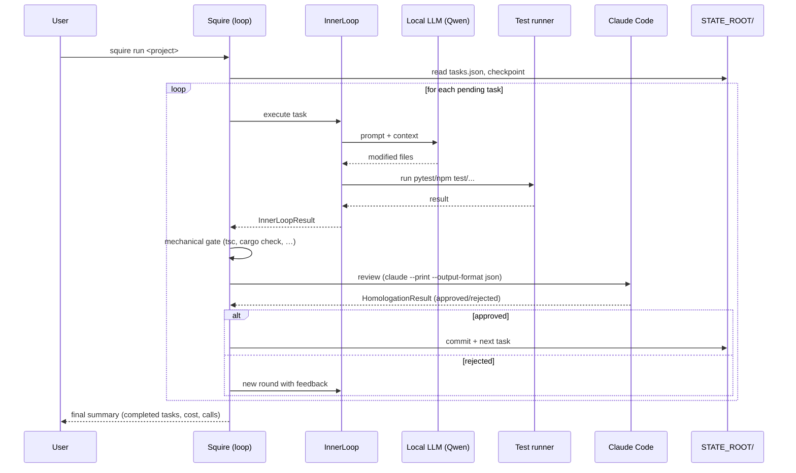
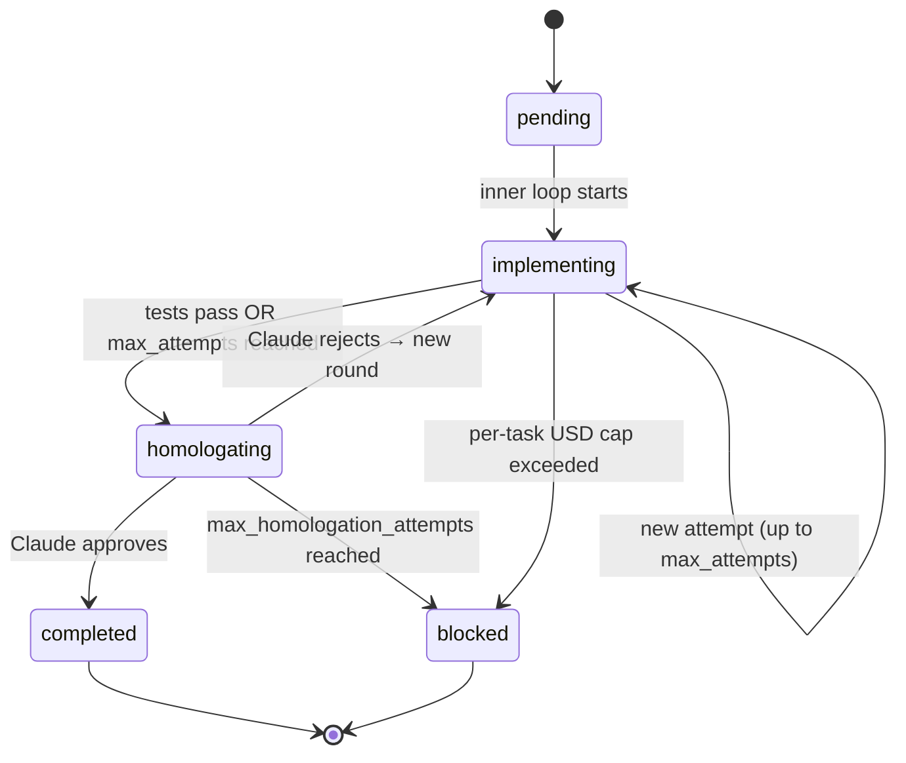

# Architecture

[🇧🇷 Português](../arquitetura.md) · 🇬🇧 English

Squire is a **two-tier orchestrator** that pairs a local LLM
(implementation) with Claude Code (review) to run software projects
semi-autonomously. This page explains the conceptual model: who does
what, why two tiers, and how the filesystem works as externalized memory.

## Table of contents

- [The two tiers](#the-two-tiers)
- [Components](#components)
- [Task lifecycle](#task-lifecycle)
- [Filesystem as externalized memory](#filesystem-as-externalized-memory)
- [Design insights](#design-insights)

## The two tiers



**Tier 1 — Execution (local LLM).** Runs on Zordon via
[LiteLLM](https://docs.litellm.ai/) exposing a local Qwen 35B. It's the
workhorse: implements, refactors, fixes. Marginal cost near zero per
call; throughput ~124 tok/s.

**Tier 2 — Supervision (Claude Code).** Invoked via
`claude --print --output-format json` for high-level engineering review:
does the code solve what the task asks? Edge cases? Project conventions?
Costs ~1000× more per call than tier 1, so the goal is a ratio of
**30 local calls for every 1 Claude Code call**.

## Components

| File                   | Responsibility                                                        |
| ---------------------- | --------------------------------------------------------------------- |
| `squire.py`            | Main loop, round cycle, cost accounting                                |
| `inner_loop.py`        | One iteration: instruction → backend → tests → result                  |
| `backends.py`          | LiteLLM, OpenCode, Crush — `CodingBackend` implementations              |
| `homologator.py`       | Invokes Claude Code for review + technical escalation                  |
| `rate_limiter.py`      | Window-based call count + daily USD budget                              |
| `checkpoint.py`        | Atomic write + session lock + Pydantic model load/save                 |
| `models.py`            | Pydantic v2 schemas: Task, Checkpoint, GlobalStats, TokenUsage, …      |
| `config.py`            | Env vars, price table, paths, cost helpers                              |
| `viking.py`            | Loads `<repo>/docs/viking/*.md` (per-domain restrictions)               |
| `progress.py`          | Generates/reads `progress.txt` (long-term memory)                       |
| `tasks_cli.py`         | `squire tasks` subcommands (list/add/edit/rm/split/plan)                |
| `squire` (bash)        | CLI front-end: dispatches subcommands, manages bg/lock/log              |

> **Insight:** the boundary between `squire.py` and `inner_loop.py` is
> important. The inner loop knows nothing about homologation, rate limit,
> or costs — it only knows "run one iteration and return a result". All
> decisions about continuing/escalating/committing belong to `Squire`.
> This lets you swap the backend (`litellm` → `opencode`) or add a RED
> phase without changing the orchestrator.

### Squire Dashboard as a second writer

The squire-dashboard (Next.js, see `docs/en/configuration.md`) is mostly
a reader — it polls the JSONs under `SQUIRE_DATA_PATH`. From P3 onwards
it can also write, but only outside `Squire`'s critical path:

- `POST /api/alerts/ack` — flip `acknowledged` or remove an entry from
  `alerts.json`.
- `POST /api/projects/<id>/budget` — patch
  `Checkpoint.rate_limit.max_daily_usd` or `max_calls_per_window`.
- `POST /api/projects/<id>/tasks/<task-id>/action` — `retry` resets
  attempts/rejections, `approve` force-approves homologation, `skip`
  flips `skip_homologation`.

Every mutation routes through `writeJsonAtomic` (`.tmp` → `rename`),
the same pattern `checkpoint.atomic_write_json` uses. Before mutating,
the route reads `session.lock` — if squire is running the target
project, it responds 409 and the operator waits for the session to
release. Squire remains the sole writer while running; the dashboard
edits only between sessions.

## Task lifecycle



Each transition is persisted to `checkpoint.json` before advancing — if
squire crashes mid-step, `squire resume` repositions the cursor exactly
where it left off. Statuses from the `TaskStatus` enum
([`models.py:25`](../../models.py)) are: `pending`, `implementing`,
`testing`, `homologating`, `completed`, `blocked`.

In parallel with task status, the `Cursor`
([`models.py:178`](../../models.py)) tracks the current `CursorStep`
within a round: `planning`, `red_phase` (TDD: writing tests before
implementation), `llm_execution`, `testing`, `homologation`, `completed`.

### What happens inside one round

1. **Test snapshot** (TDD) — before implementation,
   `InnerLoop.snapshot_test_hashes`
   ([`inner_loop.py:72`](../../inner_loop.py)) computes SHA256 of each
   `test_*.py`. After execution, `check_test_integrity` compares; if a
   test was modified, squire reverts via `git checkout` and returns an
   error to the LLM.
2. **RED phase** (if `task.tdd=True`) — writes failing tests. Done by
   Claude (`test_author=claude`, default) or by the local LLM (`test_author=local`).
3. **Inner loop** — up to `max_attempts` (default 10) attempts: build
   instruction, call backend, run tests. Every 5 failures, ask Claude
   Code for help (`TechnicalEscalation.unblock`).
4. **Mechanical gate** — before spending a Claude Code call,
   `_pre_homologation_checks` ([`squire.py:567`](../../squire.py)) runs
   typecheckers/compilers per language (tsc, cargo check, mvn compile,
   go build, etc.) and detects anti-vibe-coding patterns (`any`,
   `# type: ignore`, `unsafe`, `catch unreachable`). Failure → back to
   the inner loop without consuming budget.
5. **Homologation** — `Homologator.review`
   ([`homologator.py:63`](../../homologator.py)) sends code + context
   to Claude Code, receives `HomologationResult`. Approved: commit +
   next task. Rejected: feedback feeds back to the inner loop.
6. **Automatic escalations** — loop detected (same error in N consecutive
   rejections), no file modified in N cycles, or penultimate round with
   loop → Claude implements directly via `implement_directly`.

See [Homologation](homologation.md) for the complete state machine.

## Filesystem as externalized memory

Squire does not trust session context for long-term state. Everything
that must survive a crash/restart lives in `$SQUIRE_STATE_ROOT/`:

```text
$SQUIRE_STATE_ROOT/
├── session.lock            ← global lock (PID + TTL)
├── budget.json             ← USD caps configured via `squire budget set`
├── global-stats.json       ← aggregated daily cost/tokens/calls
├── alerts.json             ← critical alerts
└── projects/
    └── <project-id>/
        ├── project.json    ← project metadata
        ├── tasks.json      ← backlog
        ├── checkpoint.json ← cursor + rate limit state + recovery hints
        ├── history.json    ← session events (audit log)
        └── progress.txt    ← long-term memory (summary of completed
                              tasks, fed back into the prompt)
```

Every write uses the write-temp-then-rename pattern for atomicity
(`atomic_write_json` in [`checkpoint.py:30`](../../checkpoint.py)).
Details in [State and Recovery](state-and-recovery.md).

## Design insights

> **Insight — why two tiers?**
> Claude Code is too expensive for repetitive grunt work; the local LLM
> is cheap but fails at architectural judgment. Splitting the roles lets
> you target 30:1 in call ratio, controlling cost without sacrificing
> quality. Claude acts as a tech lead reviewing PRs; local acts as a
> senior dev implementing and testing.

> **Insight — why filesystem JSON instead of a database?**
> Inspired by the Manus pattern (externalized memory). Disk JSON has
> three properties: (a) human-readable — you can `cat tasks.json` and
> debug; (b) atomic write via rename — no corruption on crash;
> (c) versionable — goes in git if you want. Swapping for SQLite/Postgres
> would add latency, dependency, and zero gain at this project's scale.

> **Insight — why checkpoint after every transition?**
> Inference is the expensive part. If squire crashes between "tests
> passed" and "homologation requested", restarting from zero burns
> budget. Persisting after every step, `squire resume` loses at most
> one call of work.

> **Insight — tests are immutable during implementation.**
> Local LLMs have a strong bias toward "making tests pass" — including
> rewriting them. Squire hashes tests before implementation, verifies
> after, and reverts via git if modified. The rule also appears literally
> in every instruction sent to the backend (see `inner_loop.py:254`).
> Defense in depth: prompt + check + revert.

> **Remark:** parallelism between tasks is not supported (one task at a
> time per project, one project at a time per session lock). The choice
> was deliberate: it serializes LiteLLM/llama.cpp usage on the single
> GPU, avoids working tree conflicts, and simplifies the lock model.
> Multi-project via worktrees is on the roadmap (Feature #3 in the
> B+/A tier plan).

## Further reading

- [Complete CLI](cli.md) — all subcommands
- [Task model](tasks.md) — fields, lifecycle, JSON shape
- [Homologation](homologation.md) — gate, escalation, loop detection
- [Backends](backends.md) — when to pick LiteLLM, OpenCode, Crush
- [Cost and Budget](cost-and-budget.md) — tracking and USD budget
- [State and Recovery](state-and-recovery.md) — checkpoint, lock, recovery flows
