# Homologation

[🇧🇷 Português](../homologacao.md) · 🇬🇧 English

Homologation is the step where Claude Code reviews work done by the local
LLM and decides to approve or reject. This page covers the full cycle:
mechanical gate, verdict format, loop detection, and the three types of
technical escalation available.

## Table of contents

- [Overview](#overview)
- [Verdict structure](#verdict-structure)
- [Mechanical pre-homologation gate](#mechanical-pre-homologation-gate)
- [Loop and no-progress detection](#loop-and-no-progress-detection)
- [Technical escalation](#technical-escalation)
- [Productive wait](#productive-wait)
- [Auto-approval (skip_homologation)](#auto-approval-skip_homologation)
- [Rate limiting](#rate-limiting)

## Overview

```mermaid
sequenceDiagram
    participant IL as InnerLoop
    participant S as Squire
    participant G as Gate
    participant CC as Claude Code

    S->>IL: run inner loop (up to max_attempts)
    IL-->>S: tests (passing/failing)
    Note over S: pause 5s for Qwen to finish
    S->>G: _pre_homologation_checks(task)
    G-->>S: violations (list, may be empty)
    alt violations non-empty AND gate_failures < 2
        S->>IL: back to inner loop with violations as feedback
    else gate OK or already tried 2x
        S->>CC: claude --print --output-format json <prompt>
        CC-->>S: HomologationResult { approved, summary, feedback, fix_suggestion, usage }
        alt approved
            S->>S: commit task + next
        else rejected AND rounds left
            S->>S: record feedback, maybe escalate, back to inner loop
        else rejected AND last round
            S->>S: mark task blocked + alert
        end
    end
```



Each **round** is one `inner loop + homologation` pair. A task gets up
to `max_homologation_attempts` rounds (default 5). Each round costs at
most one Claude call for review + possibly extra escalation calls.

### Infra failures don't consume a round

The review result carries an `error_kind` classifying execution failures
(not verdicts):

- **`infra`** (transient): Claude returned invalid JSON ("Parse error"),
  empty stdout, the 180s timeout, or a non-zero exit code. The round gets
  **one free retry** after 10s — only the second consecutive failure
  consumes the round. Before this, a CLI hiccup burned one of the 5
  rounds.
- **`config`** (won't fix itself): Claude binary missing. The task is
  blocked immediately with an actionable message instead of burning all
  5 rounds against the same error.

Every real call (including the retry) is accounted for in cost and rate
limiting as usual.

### Container build requires a human (DinD deferred)

When the squire runs inside the `workspace` container, Docker is **not**
available (mounting the host socket would erode containment — see
[state-and-recovery.md](state-and-recovery.md)). If the inner loop detects
that the tests/build tried to use Docker (`docker: command not found`,
`Cannot connect to the Docker daemon`, etc.), the task is **blocked
immediately** with a critical `requires_container_build` alert, instead of
burning the remaining attempts. A human builds/verifies the image manually
(or enables rootless DinD later) and unblocks the task.

### Verdict log (`homologation_log.json`)

Every verdict (approvals, rejections, and `skip_homologation`
auto-approvals — never infra errors) is persisted in full to
`projects/<id>/homologation_log.json`, capped at the last 50 entries per
task. Unlike `Task.rejection_summaries` (300-char summaries used by loop
detection), `feedback` and `fix_suggestion` are kept complete:

```json
{"entries": [{
  "timestamp": "…", "task_id": "task-009", "attempt": 3,
  "approved": false, "summary": "…",
  "feedback": "<full text>", "fix_suggestion": "<full steps>",
  "suggestions": [], "source": "session",
  "cost_usd": 0.042, "model": "claude-opus-4-7"
}]}
```

`source` distinguishes verdicts from the normal loop (`"session"`) from
the `squire fix` cycle (`"fix"`). This file powers the dashboard's
blocked-task triage panel and is the context `squire fix` injects into
the correction.

## Verdict structure

Claude Code is invoked via `claude --print --output-format json`. It
responds with a JSON envelope (cost, usage, model, result) where
`result` contains the homologation itself in another JSON:

```json
{
  "approved": false,
  "summary": "CommitLog doesn't handle empty state (commits=[]) — crashes in production.",
  "feedback": "The CommitLog component assumes `commits` always has at least one item. When JSON is empty (`commits: []`), the component throws 'Cannot read property of undefined' on `commits[0].sha` access. This is a critical regression.",
  "fix_suggestion": "Add early return in CommitLog.tsx when commits.length === 0: render an EmptyState with message 'No commits recorded'. See src/components/EmptyState.tsx for the pattern used in the rest of the project.",
  "suggestions": [
    "Consider memoizing the timestamp-based commit sort",
    "Add a test for the empty case explicitly"
  ]
}
```

Schema in [`HomologationResult`](../../homologator.py).

| Field            | Type              | Use                                                                  |
| ---------------- | ----------------- | -------------------------------------------------------------------- |
| `approved`       | bool              | Final verdict                                                        |
| `summary`        | str               | Up to 3 lines — goes to log + `Task.rejection_summaries` (loop detect) |
| `feedback`       | str               | Full explanation — becomes context for next round                    |
| `fix_suggestion` | str               | Concrete steps for the local agent — more actionable than `feedback` |
| `suggestions`    | list[str]         | Optional improvements (even if approved)                             |
| `usage`          | TokenUsage \| None| Tokens + cost of the call — populated by squire                      |
| `error`          | str \| None       | Execution error (not review) — claude crashed, timeout, etc.         |

## Mechanical pre-homologation gate

Before spending a Claude call, squire runs **local mechanical checks**
on the local LLM's work. If something is obviously wrong, returns to
the inner loop with violations as feedback — without burning Claude
budget.

Implementation: `_pre_homologation_checks`
([`squire.py:648`](../../squire.py)).

### Per-language

Squire detects language by project files and runs the corresponding
checkers:

| Language     | Detected by               | Checks                                                                     |
| ------------ | ------------------------- | -------------------------------------------------------------------------- |
| TypeScript   | `tsconfig.json`           | `tsc --noEmit` + detects new `: any`/`as any`/`<any>`                      |
| Python       | `pyproject.toml` or `*.py`| `ast.parse` on all `.py` (syntax) + detects new `# type: ignore`           |
| Go           | `go.mod`                  | `go build ./...` + `go vet ./...`                                          |
| Rust         | `Cargo.toml`              | `cargo check` + `cargo clippy -- -D warnings` + detects `#[allow]`/`unsafe`|
| Zig          | `build.zig`               | `zig build` + `zig fmt --check .` + detects `_ =`/`catch unreachable`     |
| Java/Kotlin  | `build.gradle*` or `pom.xml`| `gradle compileJava` or `mvn compile -q`                                |
| Ruby         | `Gemfile`                 | `ruby -c <file>` on each `.rb`                                             |

### Universal checks

- **Mandatory test file** (when `task.tdd=true`): if no `test_*.py`,
  `*.test.ts`, `*_test.go`, etc. exists → violation. Ensures the RED
  phase produced something.

### Anti-vibe-coding

Patterns the local LLM introduces to "make the error go away" are
detected and flagged as violations:

| Pattern                                  | Language        | Why a violation                                          |
| ---------------------------------------- | --------------- | -------------------------------------------------------- |
| `: any` / `as any` / `<any>` added       | TypeScript      | Silences type checker instead of fixing the type         |
| `# type: ignore` added                   | Python          | Same                                                     |
| `#[allow(...)]` or `unsafe` added        | Rust            | Silences clippy / works around borrow checker            |
| `_ = expr` (discard error) or `catch unreachable` | Zig    | Swallows errors that should be handled                  |

> **Insight — anti-vibe-coding as a contract.**
> Small local LLMs have a strong bias for "if the error complained,
> make it go away". The cheapest route is to silence the checker. The
> gate detects this and returns with explicit instructions. The rule
> "PROHIBITED to modify test_*.py" follows the same philosophy.

### Retry limit in the gate

If violations don't disappear after 2 consecutive attempts, squire
**lets it through** to Claude Code anyway:

```python
if not self.dry_run and gate_failures < 2:
    violations = self._pre_homologation_checks(task)
    if violations:
        gate_failures += 1
        # ... back to inner loop
```

The reason: if the inner loop isn't fixing violations, it's better to
spend one Claude call to understand why than to loop on the gate.
Claude sees the real code and can judge if violations are symptoms of
something else.

## Loop and no-progress detection

### Rejection loop

`Task.rejection_summaries` keeps the last 10 rejection `summary`s.
`_is_looping` ([`squire.py:374`](../../squire.py)) checks whether the
last N (default `SQUIRE_LOOP_DETECT=3`) rejections share 4+ significant
words:

```python
def _is_looping(self, task) -> bool:
    if len(task.rejection_summaries) < threshold:
        return False
    last_n = task.rejection_summaries[-threshold:]
    word_sets = [set(s.lower().split()) - stopwords for s in last_n]
    common = word_sets[0].copy()
    for ws in word_sets[1:]:
        common &= ws
    return len(common) >= 4
```

When detected, triggers **forced escalation** (below). Stopwords are
Portuguese ("o", "a", "de", etc.) — multilingual support is on the
roadmap.

### No progress

`Task.no_progress_streak` counts consecutive cycles where the backend
didn't modify any file. Reaching `SQUIRE_NO_PROGRESS` (default 3) →
forced escalation. Meaning: the backend is being called but returning
output without concrete action — clear stalemate sign.

## Technical escalation

When the local LLM stalls, squire can call Claude Code in three ways,
in increasing order of "force":

### 1. `unblock` — Claude advises, local executes

`TechnicalEscalation.unblock` ([`homologator.py`](../../homologator.py)).
Claude receives context (last error, files touched, tests) and returns
**text instructions** that become `extra_instructions` for the next
inner-loop call. The local LLM keeps going.

Fires on:

- Every 5 failed attempts within the inner loop ([`squire.py`](../../squire.py))
- When `_is_looping` detects repetitive pattern (forced escalation)
- When `no_progress_streak >= NO_PROGRESS_THRESHOLD`

### 2. `implement_directly` — Claude writes directly

`TechnicalEscalation.implement_directly`. Claude writes the files
directly (`filepath:` fence format) and squire applies via
`parse_and_apply_files`. More expensive because Claude is doing
implementation work, not just review.

Fires on:

- **`effort=low` + 2 rejections + loop** — `_run_homologation` line 889
  in squire.py. Heuristic: tasks marked "easy" that aren't converging
  indicate imprecise description or edge case — cheaper for Claude to
  implement than 3 more local rounds.
- **Penultimate round with persistent loop** — last chance before
  blocking. Claude implements and we send to final homologation.

### 3. RED phase with `test_author=claude`

Technically not escalation, but uses Claude before the inner loop starts.
Worth mentioning here because it's also a paid call: in the RED phase,
if `task.test_author=claude` (default), Claude writes the tests. See
[Tasks: TDD](tasks.md#tdd-and-red-phase).

> **Insight — escalation is strategic, not desperate.**
> Escalation doesn't fire on any failure — only on patterns signaling
> stalemate (loop) or upstream-problem symptoms (no progress). Normal
> failures (tests failing, wrong refactors) keep going in the inner
> loop with the local LLM. This preserves the 30:1 target.

## Productive wait

When rate limit activates between rounds (`can_afford` returns `False`),
squire **does not sleep**. Instead, it calls `_wait_productively`
([`squire.py:626`](../../squire.py)) which keeps running the inner
loop with the accumulated last-rejection feedback:

```python
def _wait_productively(self, task, last_feedback, test_hashes):
    while not self.rate_limiter.can_call():
        wait = self.rate_limiter.wait_seconds()
        log(f"Rate limit: {wait // 60:.0f}min restantes — continuando inner loop...", "warn")
        task.attempts = 0
        self._run_inner_loop(task, homologation_feedback=last_feedback, test_hashes=test_hashes)
```

Advantages:

- $0 cost (local LiteLLM)
- Refines code with Claude's last feedback
- When rate limit resets, the next Claude call sees code closer to
  expected — better chance of approving

## Auto-approval (skip_homologation)

`Task.skip_homologation=true` turns off Claude review for a specific
task. Squire still runs the inner loop and gate, but marks the task as
approved after tests pass.

```json
{
  "id": "task-001",
  "title": "Add Dockerfile",
  "skip_homologation": true,
  "tdd": false
}
```

When to use:

- Trivial boilerplate (Dockerfile, `.env.example`, gitignore)
- Mechanical migration tasks (mass renames, import updates)
- Initial setups where "passes tests" is sufficient verdict

> **Remark — does `skip_homologation` bypass the mechanical gate?**
> No. The gate still runs (typechecker, syntax, anti-vibe-coding). Only
> the Claude call is skipped. You still have protection against `: any`
> sneaking in.

## Rate limiting

Before each Claude call (review or escalation), squire checks
`rate_limiter.can_afford(estimated_cost)`. Two gates:

1. **Call count** — `SQUIRE_CC_MAX_CALLS` (default 10) calls every
   `SQUIRE_CC_WINDOW_MIN` (default 30) minutes
2. **USD budget** — `SQUIRE_DAILY_USD_BUDGET` (default 0 = no limit)
   USD per day

Details in [Cost and Budget](cost-and-budget.md). In short: if either
gate closes, squire either pauses or does productive wait.

## Further reading

- [Tasks](tasks.md) — `skip_homologation`, `tdd`, `effort`
- [Backends](backends.md) — who runs the inner loop
- [Cost and Budget](cost-and-budget.md) — rate limit + USD budget
- [Viking Pattern](viking-pattern.md) — inject domain restrictions into the review
