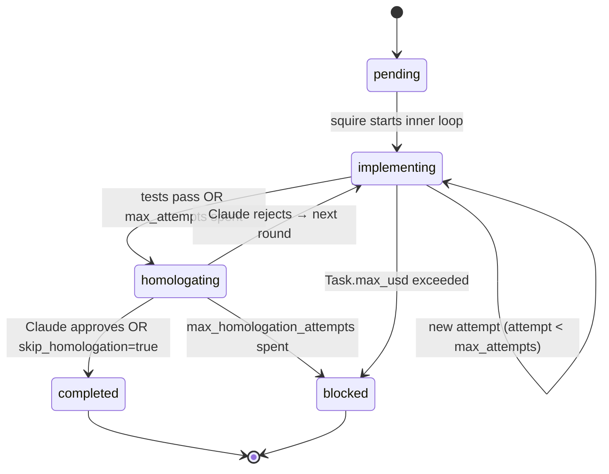

# Tasks

[🇧🇷 Português](../tasks.md) · 🇬🇧 English

Squire's unit of work is the **task**. Each project has a `tasks.json`
with an ordered list; squire processes them in order, one at a time.
This page covers the data model, lifecycle, knobs, and CLI authoring
workflows.

## Table of contents

- [Minimum structure](#minimum-structure)
- [Fields by category](#fields-by-category)
- [Status lifecycle](#status-lifecycle)
- [TDD and RED phase](#tdd-and-red-phase)
- [Effort and model routing](#effort-and-model-routing)
- [Per-task cost](#per-task-cost)
- [CLI authoring workflows](#cli-authoring-workflows)
- [Complete example](#complete-example)

## Minimum structure

The smallest valid `tasks.json`:

```json
{
  "tasks": [
    {
      "id": "task-001",
      "title": "Initial setup",
      "description": "Describe what should be done here."
    }
  ]
}
```

All other fields have sensible defaults. The complete schema is in
[`models.py:104`](../../models.py) (`Task` class).

## Fields by category

### Identity

| Field         | Type     | Default       | Description                                    |
| ------------- | -------- | ------------- | ---------------------------------------------- |
| `id`          | str      | (required)    | Unique identifier within the project           |
| `title`       | str      | (required)    | Short title (≤ 70 chars recommended)           |
| `description` | str      | `""`          | What to do. Be specific — this is the prompt.  |

### Inner loop control

| Field                 | Type            | Default | Description                                                                |
| --------------------- | --------------- | ------- | -------------------------------------------------------------------------- |
| `max_attempts`        | int             | 10      | Attempts within one round before advancing to homologation                 |
| `attempts`            | int             | 0       | Current counter (squire increments, don't touch manually)                  |
| `no_progress_streak`  | int             | 0       | Consecutive cycles without modified files. ≥ `NO_PROGRESS_THRESHOLD` → escalation |
| `claude_code_assisted`| bool            | false   | Marked `True` when any technical escalation fired                          |

### Homologation control

| Field                       | Type               | Default | Description                                                          |
| --------------------------- | ------------------ | ------- | -------------------------------------------------------------------- |
| `max_homologation_attempts` | int                | 5       | Maximum rounds (inner loop + homologation)                            |
| `homologation_attempt`      | int                | 0       | Current round                                                         |
| `homologation_result`       | `"approved"`/`"rejected"`/`null` | `null` | Final verdict                                              |
| `skip_homologation`         | bool               | false   | Auto-approve after inner loop (no Claude call). Useful for boilerplate. |
| `rejection_summaries`       | list[str]          | `[]`    | Last N rejection summaries for loop detection                         |

### TDD

| Field         | Type                  | Default     | Description                                            |
| ------------- | --------------------- | ----------- | ------------------------------------------------------ |
| `tdd`         | bool                  | `true`      | Runs RED phase before implementation                   |
| `test_author` | `"claude"`/`"local"`  | `"claude"`  | Who writes tests in RED phase                          |

### Effort and cost

| Field      | Type                                | Default    | Description                                                    |
| ---------- | ----------------------------------- | ---------- | -------------------------------------------------------------- |
| `effort`   | `"low"` / `"medium"` / `"high"`     | `"medium"` | Routes to `MODEL_LOW`/`MEDIUM`/`HIGH` (env vars)               |
| `max_usd`  | float \| null                       | `null`     | USD cap for this task. `null`/`0` = uses `PER_TASK_USD_CAP` global |
| `cost_usd` | float                               | `0.0`      | Accumulated cost (squire updates)                              |

### Subtasks

| Field      | Type            | Default | Description                                          |
| ---------- | --------------- | ------- | ---------------------------------------------------- |
| `subtasks` | list[Subtask]   | `[]`    | Internal checkpoints (don't trigger reviews)         |

Subtask shape: `{id, title, status}`. They're informational today (appear
in the prompt to guide implementation), don't trigger individual reviews.
Future work in Feature #3 of the roadmap (task dependencies).

## Status lifecycle



Statuses from [`TaskStatus`](../../models.py) enum: `pending`,
`implementing`, `testing`, `homologating`, `completed`, `blocked`.

**Blocked tasks** are not fatal — squire moves on to the next pending
task. To unblock:

- `squire unblock <project> <task-id>` — keeps code in working tree
- `squire reset <project> <task-id>` — discards code (`git reset`)

See [State and Recovery](state-and-recovery.md).

## TDD and RED phase

When `task.tdd=true` (default), before the inner loop, squire runs a
**RED phase**: writes the tests that define expected behavior, without
implementing production code. The tests MUST FAIL at this phase — that's
why it's called RED (TDD traffic light: red → green → refactor).

After RED, squire computes SHA256 of each test file and protects that
list throughout the task. If the backend modifies a test during
implementation:

1. Squire detects via hash mismatch ([`inner_loop.py:81`](../../inner_loop.py))
2. Reverts the file via `git checkout`
3. Returns error to the backend with a clear message ("PROIBIDO modificar test_*.py")

### Who writes the tests?

- `test_author=claude` (default) — Claude Code writes tests in RED.
  More expensive but more reliable (Claude understands the task's intent).
- `test_author=local` — local LLM writes tests. Zero cost (in local
  backends) but the LLM tends to write "easy-to-pass" tests.

> **Insight — why `test_author=claude` by default?**
> The local LLM has a strong bias to write tests it knows will pass.
> Result: test passes, but actual behavior isn't what the task asked.
> Paying for one Claude call in RED is safe spending: you're investing in
> *defining* the problem, not solving it. The solution exploits tier 1
> (local) to iterate cheaply.

### Skipping TDD

For pure boilerplate (creating Dockerfile, generating `.env.example`), set
`tdd: false` in `tasks.json`:

```json
{
  "id": "task-001",
  "title": "Add Dockerfile",
  "tdd": false,
  "skip_homologation": true
}
```

## Effort and model routing

The `effort` field ([`models.Effort`](../../models.py)) controls which
model variant the backend uses on the call:

| Effort   | Env var               | Default          | Typical use                                |
| -------- | --------------------- | ---------------- | ------------------------------------------ |
| `low`    | `SQUIRE_MODEL_LOW`    | `journal-synth`  | Renames, trivial refactors, snippets       |
| `medium` | `SQUIRE_MODEL_MEDIUM` | `journal-synth`  | Default — normally-sized features          |
| `high`   | `SQUIRE_MODEL_HIGH`   | `journal-synth`  | Complex logic, edge cases, perf-critical   |

By default all point to the same model (no differentiation). To enable
routing, set env vars pointing to different models, e.g.,
`SQUIRE_MODEL_HIGH=qwen-72b-instruct`.

### Special behavior for `effort: low`

Tasks with `effort=low` that enter a loop (same rejection repeated in N
rounds) trigger **early escalation**: Claude implements directly instead
of having the local LLM keep trying. Logic in
[`squire.py:951`](../../squire.py): "easy tasks that aren't converging
indicate either bad description or obscure edge case — calling Claude
directly is cheaper than 3 more local rounds".

## Per-task cost

`Task.max_usd` defines an individual USD cap. If the task hits or exceeds
the value, squire:

1. Pauses immediately (between attempts, not mid-call)
2. Marks the task as `blocked`
3. Creates an `Alert` (warning) in `alerts.json`
4. Moves to the next pending task

If `max_usd` is `null` or `0`, squire uses `PER_TASK_USD_CAP` (global env
var). If both are zero, no per-task cap.

See [Cost and Budget](cost-and-budget.md) for the complete tracking +
budget system.

## CLI authoring workflows

Three ways to create tasks, from most manual to most automated:

### 1. Edit `tasks.json` directly

Edit the JSON. Use `squire tasks list <project>` to verify.

### 2. `squire tasks add` (interactive)

```bash
$ squire tasks add my-app --title "Add timeline pagination" \
    --desc "10 items per page, with prev/next" --max-homolog 3
✓ task-007 adicionada: Add timeline pagination
```

### 3. `squire tasks plan` (Claude drafts)

```bash
$ squire tasks plan my-app --desc "REST API for managing users (CRUD)"
[planning] Claude gerando rascunho de tasks...
[planning] 8 tasks propostas:
   1. Setup FastAPI + initial structure
   2. User model (Pydantic) + schemas
   ...
[planning] Refinar? [y/N] y
[planning] O que ajustar? > merge 1 and 2 into one task
[planning] Claude re-gerando...
[planning] 7 tasks propostas:
   ...
[planning] Refinar? [y/N] n
[planning] Modo: (s)ubstituir / (a)nexar / (c)ancelar? a
✓ 7 tasks anexadas a tasks.json (total: 12 tasks)
```

Up to 3 refinement cycles. After the last, choose:

- `s` replace — backup current `tasks.json` + write new
- `a` append — add to end of current `tasks.json`
- `c` cancel — nothing is written

### 4. `squire tasks split` (Claude subdivides one task)

When a task grew larger than it should have:

```bash
$ squire tasks split my-app task-003
[split] Claude analisando task-003...
[split] Sugere subdividir em 3 subtasks:
   - 3a. Create base Modal component
   - 3b. Add enter/exit animation
   - 3c. Wire onClose callback with Esc key
[split] Aplicar? [y/N] y
✓ task-003 dividida em task-003a, task-003b, task-003c
```

The original task is replaced by the children. IDs become `<original>a`, `<original>b`, etc.

## Complete example

A realistic `tasks.json` with three tasks illustrating different knobs:

<details>
<summary>Click to expand full JSON</summary>

```json
{
  "tasks": [
    {
      "id": "task-001",
      "title": "Setup Next.js + Tailwind scaffolding",
      "description": "Create package.json, tsconfig.json, tailwind.config.ts, and initial structure in src/app/. Initialize git in the repo if needed.",
      "status": "pending",
      "max_attempts": 5,
      "max_homologation_attempts": 1,
      "skip_homologation": true,
      "tdd": false,
      "effort": "low"
    },
    {
      "id": "task-002",
      "title": "Implement ProjectCard component",
      "description": "React functional component that takes a Project (see src/lib/types.ts) and renders name, status (with colored badge) and task progress. Must be a server component (no 'use client').",
      "status": "pending",
      "max_attempts": 10,
      "max_homologation_attempts": 5,
      "tdd": true,
      "test_author": "claude",
      "effort": "medium"
    },
    {
      "id": "task-003",
      "title": "Implement auto-refresh logic with WebSocket",
      "description": "Add WebSocket connection to receive history.json updates in real time. Reconnect with exponential backoff. Fall back to polling if WS fails 3 times.",
      "status": "pending",
      "max_attempts": 15,
      "max_homologation_attempts": 5,
      "tdd": true,
      "test_author": "claude",
      "effort": "high",
      "max_usd": 1.50,
      "subtasks": [
        {"id": "task-003-a", "title": "useWebSocket hook with reconnect", "status": "pending"},
        {"id": "task-003-b", "title": "Exponential backoff", "status": "pending"},
        {"id": "task-003-c", "title": "Polling fallback", "status": "pending"}
      ]
    }
  ]
}
```

</details>

Notes on the example:

- **task-001** is boilerplate: `skip_homologation=true` (not worth spending
  Claude), `tdd=false` (no "behavior" to test), `effort=low` (cheap model).
- **task-002** is the standard: TDD enabled, Claude writes tests, medium effort.
- **task-003** is the most expensive: `effort=high` (better model),
  `max_usd=1.50` (explicit cap because we know it will iterate),
  documented subtasks. If it exceeds $1.50, it's marked blocked instead
  of burning more.

## Further reading

- [Homologation](homologation.md) — what happens when `tdd=true` and how
  `skip_homologation` interacts with the cycle
- [Backends](backends.md) — how `effort` translates to model parameters
- [Cost and Budget](cost-and-budget.md) — `max_usd`, spend accounting
- [CLI](cli.md#tasks) — `squire tasks` in detail
