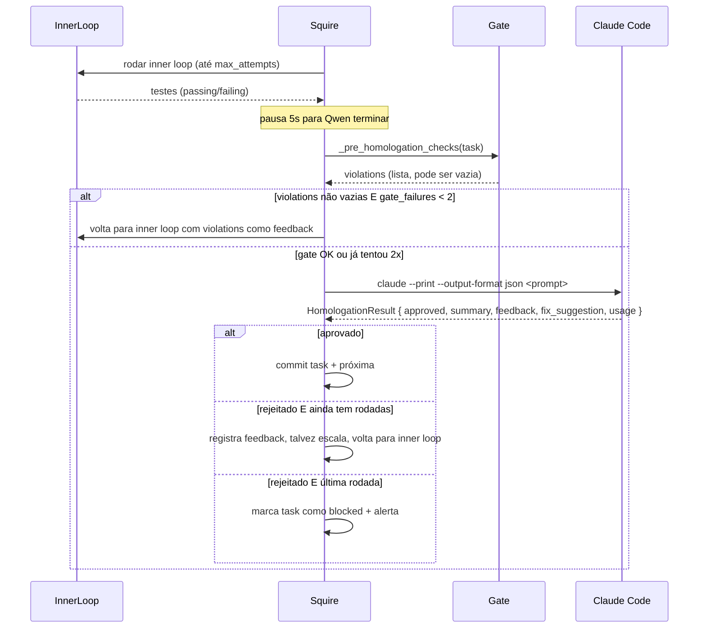

# Homologação

🇧🇷 Português · [🇬🇧 English](en/homologation.md)

Homologação é a etapa em que o Claude Code revisa o trabalho feito pelo
LLM local e decide aprovar/rejeitar. Esta página explica o ciclo completo:
gate mecânico, formato do veredito, detecção de loops, e os três tipos de
escalação técnica disponíveis.

## Sumário

- [Visão geral](#visão-geral)
- [Estrutura do veredito](#estrutura-do-veredito)
- [Gate mecânico pré-homologação](#gate-mecânico-pré-homologação)
- [Detecção de loops e sem-progresso](#detecção-de-loops-e-sem-progresso)
- [Escalação técnica](#escalação-técnica)
- [Productive wait](#productive-wait)
- [Auto-aprovação (skip_homologation)](#auto-aprovação-skip_homologation)
- [Rate limiting](#rate-limiting)

## Visão geral



Cada **rodada** é um par `inner loop + homologação`. Uma task tem até
`max_homologation_attempts` rodadas (default 5). Cada rodada gasta no
máximo uma chamada Claude para review + possíveis chamadas extras de
escalação.

### Falhas de infra não consomem rodada

O resultado do review carrega um `error_kind` que classifica falhas de
execução (não de veredito):

- **`infra`** (transiente): Claude retornou JSON inválido ("Parse error"),
  stdout vazio, timeout de 180s ou exit code ≠ 0. A rodada ganha **um
  retry gratuito** após 10s — só a segunda falha consecutiva consome a
  rodada. Antes disso, um soluço do CLI queimava uma das 5 rodadas.
- **`config`** (não se resolve sozinho): binário do Claude ausente. A
  task é bloqueada imediatamente com mensagem acionável, em vez de
  queimar as 5 rodadas contra o mesmo erro.

Cada chamada real (incluindo o retry) é contabilizada em custo e rate
limit normalmente.

### Log de vereditos (`homologation_log.json`)

Todo veredito (aprovações, rejeições e auto-aprovações de
`skip_homologation` — nunca erros de infra) é persistido na íntegra em
`projects/<id>/homologation_log.json`, com cap das últimas 50 entradas por
task. Diferente de `Task.rejection_summaries` (resumos de 300 chars usados
pela detecção de loops), aqui `feedback` e `fix_suggestion` ficam completos:

```json
{"entries": [{
  "timestamp": "…", "task_id": "task-009", "attempt": 3,
  "approved": false, "summary": "…",
  "feedback": "<texto completo>", "fix_suggestion": "<passos completos>",
  "suggestions": [], "source": "session",
  "cost_usd": 0.042, "model": "claude-opus-4-7"
}]}
```

`source` distingue vereditos do loop normal (`"session"`) dos do ciclo
`squire fix` (`"fix"`). É a fonte do painel de triagem de tasks bloqueadas
no dashboard e o contexto que o `squire fix` injeta na correção.

## Estrutura do veredito

O Claude Code é invocado via `claude --print --output-format json`. Ele
responde com um envelope JSON (cost, usage, model, result) onde `result`
contém a homologação propriamente dita em outro JSON:

```json
{
  "approved": false,
  "summary": "CommitLog não trata estado vazio (commits=[]) — quebra em produção.",
  "feedback": "O componente CommitLog assume que `commits` sempre tem ao menos um item. Quando o JSON está vazio (`commits: []`), o componente lança 'Cannot read property of undefined' no acesso a commits[0].sha. Isto é um regressão crítica.",
  "fix_suggestion": "Adicionar early return em CommitLog.tsx quando commits.length === 0: renderizar um EmptyState com mensagem 'Nenhum commit registrado'. Veja src/components/EmptyState.tsx para o padrão usado no resto do projeto.",
  "suggestions": [
    "Considerar memoizar o sort de commits por timestamp",
    "Adicionar test para o caso vazio explicitamente"
  ]
}
```

Schema em [`HomologationResult`](../homologator.py).

| Campo            | Tipo              | Uso                                                                  |
| ---------------- | ----------------- | -------------------------------------------------------------------- |
| `approved`       | bool              | Veredito final                                                       |
| `summary`        | str               | Até 3 linhas — vai para log + `Task.rejection_summaries` (loop detect) |
| `feedback`       | str               | Explicação completa — vira contexto para a próxima rodada            |
| `fix_suggestion` | str               | Passos concretos para o agente local — mais acionável que `feedback` |
| `suggestions`    | list[str]         | Melhorias opcionais (mesmo se aprovado)                              |
| `usage`          | TokenUsage \| None| Tokens + custo da chamada — populado pelo squire                     |
| `error`          | str \| None       | Erro de execução (não review) — claude crashou, timeout, etc.        |

## Gate mecânico pré-homologação

Antes de gastar uma chamada Claude, o squire roda **verificações mecânicas
locais** sobre o trabalho do LLM local. Se algo óbvio está errado, devolve
para o inner loop com violations como feedback — sem queimar budget Claude.

Implementação: `_pre_homologation_checks` ([`squire.py:648`](../squire.py)).

### Por linguagem

O squire detecta a linguagem pelos arquivos de projeto e roda os checkers
correspondentes:

| Linguagem    | Detectada por             | Checks                                                                     |
| ------------ | ------------------------- | -------------------------------------------------------------------------- |
| TypeScript   | `tsconfig.json`           | `tsc --noEmit` + detecta novo `: any`/`as any`/`<any>`                     |
| Python       | `pyproject.toml` ou `*.py`| `ast.parse` em todos `.py` (syntax) + detecta novo `# type: ignore`        |
| Go           | `go.mod`                  | `go build ./...` + `go vet ./...`                                          |
| Rust         | `Cargo.toml`              | `cargo check` + `cargo clippy -- -D warnings` + detecta `#[allow]`/`unsafe`|
| Zig          | `build.zig`               | `zig build` + `zig fmt --check .` + detecta `_ =`/`catch unreachable`     |
| Java/Kotlin  | `build.gradle*` ou `pom.xml`| `gradle compileJava` ou `mvn compile -q`                                 |
| Ruby         | `Gemfile`                 | `ruby -c <file>` em cada `.rb`                                             |

### Checks universais

- **Arquivo de teste obrigatório** (quando `task.tdd=true`): se nenhum
  `test_*.py`, `*.test.ts`, `*_test.go`, etc. existe, violation. Garante
  que a fase RED produziu algo.

### Anti-vibe-coding

Padrões que o LLM local introduz para "fazer o erro desaparecer" são
detectados e marcados como violations:

| Padrão                              | Linguagem        | Por que violation                                          |
| ----------------------------------- | ---------------- | ---------------------------------------------------------- |
| `: any` / `as any` / `<any>` adicionado | TypeScript    | Silencia o type checker em vez de corrigir o tipo          |
| `# type: ignore` adicionado         | Python           | Idem                                                       |
| `#[allow(...)]` ou `unsafe` adicionado | Rust          | Silencia clippy / contorna borrow checker                  |
| `_ = expr` (descartar erro) ou `catch unreachable` | Zig | Engole erros que deveriam ser tratados                  |

> **Insight — anti-vibe-coding como contrato.**
> LLMs locais pequenos têm bias forte para "se o erro reclamou, faça-o
> ir embora". A rota mais barata é silenciar o checker. O gate detecta
> e devolve com instruções explícitas. A regra "PROIBIDO modificar
> test_*.py" segue a mesma filosofia.

### Limite de retries no gate

Se as violations não somem após 2 tentativas seguidas, o squire **deixa
passar** para o Claude Code mesmo assim:

```python
if not self.dry_run and gate_failures < 2:
    violations = self._pre_homologation_checks(task)
    if violations:
        gate_failures += 1
        # ... volta para inner loop
```

O motivo: se o inner loop não está corrigindo as violations, é melhor
gastar uma chamada Claude para entender por quê do que ficar em loop
no gate. O Claude vê o código real e pode julgar se as violations são
sintoma de outra coisa.

## Detecção de loops e sem-progresso

### Loop de rejeição

`Task.rejection_summaries` mantém as últimas 10 `summary` de rejeições.
A função `_is_looping` ([`squire.py:374`](../squire.py)) verifica se as
últimas N (default `SQUIRE_LOOP_DETECT=3`) rejeições compartilham 4+ palavras
significativas:

```python
def _is_looping(self, task) -> bool:
    if len(task.rejection_summaries) < threshold:
        return False
    last_n = task.rejection_summaries[-threshold:]
    word_sets = [set(s.lower().split()) - stopwords for s in last_n]
    common = word_sets[0].copy()
    for ws in word_sets[1:]:
        common &= ws
    return len(common) >= 4
```

Quando detecta, dispara **escalação forçada** (ver abaixo). Stopwords são
em português ("o", "a", "de", etc.) — multilingual support está no roadmap.

### Sem progresso

`Task.no_progress_streak` conta ciclos consecutivos onde o backend não
modificou nenhum arquivo. Ao atingir `SQUIRE_NO_PROGRESS` (default 3),
escalação forçada. Significado: o backend está chamando, mas devolvendo
output sem ação concreta — sinal claro de impasse.

## Escalação técnica

Quando o LLM local empaca, o squire pode chamar o Claude Code de três
formas, em ordem crescente de "violência":

### 1. `unblock` — Claude orienta, local executa

`TechnicalEscalation.unblock` ([`homologator.py`](../homologator.py)). O
Claude recebe o contexto (último erro, arquivos tocados, testes) e devolve
**instruções textuais** que viram `extra_instructions` para a próxima
chamada do inner loop. O LLM local segue continuando.

Dispara em:

- A cada 5 tentativas falhas dentro do inner loop ([`squire.py`](../squire.py))
- Quando `_is_looping` detecta padrão repetitivo (escalação forçada)
- Quando `no_progress_streak >= NO_PROGRESS_THRESHOLD`

### 2. `implement_directly` — Claude escreve direto

`TechnicalEscalation.implement_directly`. Claude escreve os arquivos
diretamente (formato `filepath:` fences) e o squire aplica via
`parse_and_apply_files`. Mais caro porque Claude está fazendo o trabalho
de implementação, não só revisão.

Dispara em:

- **`effort=low` + 2 rejeições + loop** — `_run_homologation` linha 889 em
  squire.py. Heurística: tasks marcadas como "fáceis" que não convergem
  indicam descrição imprecisa ou edge case — mais barato Claude implementar
  do que 3 rodadas locais a mais.
- **Penúltima rodada com loop persistente** — última chance antes de
  bloquear. Claude implementa e mandamos para a homologação final.

### 3. RED phase com `test_author=claude`

Tecnicamente não é escalação, mas usa o Claude antes do inner loop começar.
Vale mencionar aqui porque também é uma chamada paga: na fase RED, se
`task.test_author=claude` (default), o Claude escreve os testes. Veja
[Tasks: TDD](tasks.md#tdd-e-fase-red).

> **Insight — escalação é estratégica, não desespero.**
> A escalação não dispara em qualquer falha — só em padrões que sinalizam
> impasse (loop) ou sintoma de problema upstream (sem progresso). Falhas
> normais (testes falhando, refactors errados) continuam no inner loop
> com o LLM local. Isso preserva a meta de 30:1.

## Productive wait

Quando o rate limit ativa entre rodadas (`can_afford` retorna `False`),
o squire **não dorme**. Em vez disso, chama `_wait_productively`
([`squire.py:626`](../squire.py)) que continua executando o inner loop
com o feedback acumulado da última rejeição:

```python
def _wait_productively(self, task, last_feedback, test_hashes):
    while not self.rate_limiter.can_call():
        wait = self.rate_limiter.wait_seconds()
        log(f"Rate limit: {wait // 60:.0f}min restantes — continuando inner loop...", "warn")
        task.attempts = 0
        self._run_inner_loop(task, homologation_feedback=last_feedback, test_hashes=test_hashes)
```

Vantagens:

- Custo $0 (LiteLLM local)
- Refina o código com o último feedback do Claude
- Quando o rate limit reseta, a próxima chamada Claude vê um código mais
  próximo do esperado — mais chance de aprovar

## Auto-aprovação (skip_homologation)

`Task.skip_homologation=true` desliga o Claude review para uma task
específica. O squire ainda roda o inner loop e o gate, mas marca a task
como aprovada após os testes passarem.

```json
{
  "id": "task-001",
  "title": "Adicionar Dockerfile",
  "skip_homologation": true,
  "tdd": false
}
```

Quando usar:

- Boilerplate trivial (Dockerfile, `.env.example`, gitignore)
- Tasks de migração mecânica (renomeio em massa, atualização de imports)
- Setups iniciais onde "passa nos testes" é veredito suficiente

> **Remark — `skip_homologation` ignora o gate mecânico?**
> Não. O gate continua rodando (typechecker, syntax, anti-vibe-coding).
> Só pula a chamada Claude. Você ainda tem proteção contra `: any`
> introduzido às escondidas.

## Rate limiting

Antes de cada chamada Claude (review ou escalação), o squire verifica
`rate_limiter.can_afford(estimated_cost)`. Dois gates:

1. **Call count** — `SQUIRE_CC_MAX_CALLS` (default 10) calls a cada
   `SQUIRE_CC_WINDOW_MIN` (default 30) minutos
2. **USD budget** — `SQUIRE_DAILY_USD_BUDGET` (default 0 = sem limite)
   USD por dia

Detalhes em [Custos e orçamento](custos-e-orcamento.md). Em resumo: se
qualquer um dos gates fecha, o squire ou pausa, ou faz productive wait.

## Próximas leituras

- [Tasks](tasks.md) — `skip_homologation`, `tdd`, `effort`
- [Backends](backends.md) — quem roda o inner loop
- [Custos e orçamento](custos-e-orcamento.md) — rate limit + USD budget
- [Padrão Viking](padrao-viking.md) — injetar restrições de domínio no review
