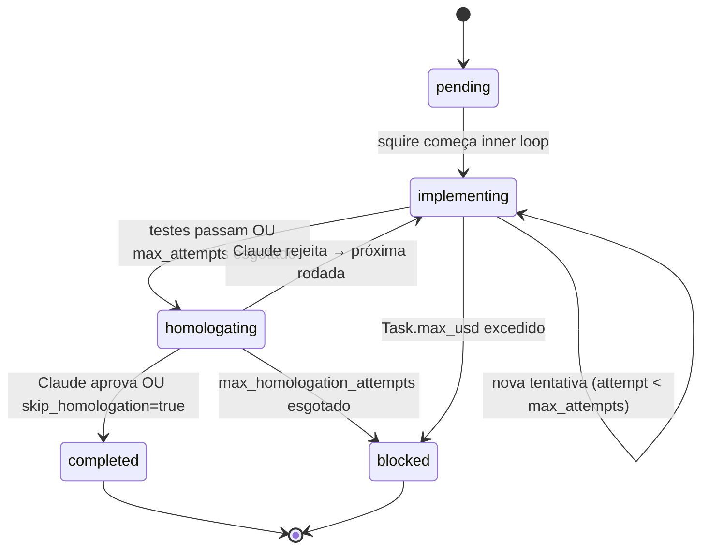

# Tasks

🇧🇷 Português · [🇬🇧 English](en/tasks.md)

A unidade de trabalho do squire é a **task**. Cada projeto tem um `tasks.json`
com uma lista ordenada de tasks; o squire as processa em ordem, uma de cada
vez. Este documento explica o modelo de dados, lifecycle, knobs disponíveis,
e os workflows de autoria via CLI.

## Sumário

- [Estrutura mínima](#estrutura-mínima)
- [Campos por categoria](#campos-por-categoria)
- [Lifecycle de status](#lifecycle-de-status)
- [TDD e fase RED](#tdd-e-fase-red)
- [Effort e roteamento de modelo](#effort-e-roteamento-de-modelo)
- [Custo por task](#custo-por-task)
- [Workflows de autoria via CLI](#workflows-de-autoria-via-cli)
- [Exemplo completo](#exemplo-completo)

## Estrutura mínima

O menor `tasks.json` válido:

```json
{
  "tasks": [
    {
      "id": "task-001",
      "title": "Setup inicial",
      "description": "Descreva aqui o que deve ser feito."
    }
  ]
}
```

Todos os outros campos têm defaults sensatos. O schema completo está em
[`models.py:104`](../models.py) (classe `Task`).

## Campos por categoria

### Identidade

| Campo         | Tipo     | Default       | Descrição                                      |
| ------------- | -------- | ------------- | ---------------------------------------------- |
| `id`          | str      | (obrigatório) | Identificador único dentro do projeto          |
| `title`       | str      | (obrigatório) | Título curto (≤ 70 chars recomendado)          |
| `description` | str      | `""`          | O que fazer. Seja específico, este é o prompt. |

### Controle do inner loop

| Campo                 | Tipo            | Default | Descrição                                                                |
| --------------------- | --------------- | ------- | ------------------------------------------------------------------------ |
| `max_attempts`        | int             | 10      | Tentativas dentro de uma rodada antes de avançar para homologação        |
| `attempts`            | int             | 0       | Contador corrente (incrementado pelo squire, não mexer manualmente)      |
| `no_progress_streak`  | int             | 0       | Ciclos consecutivos sem arquivos modificados. ≥ `NO_PROGRESS_THRESHOLD` → escalação |
| `claude_code_assisted`| bool            | false   | Marca `True` quando alguma escalação técnica foi acionada                |

### Controle de homologação

| Campo                       | Tipo               | Default | Descrição                                                              |
| --------------------------- | ------------------ | ------- | ---------------------------------------------------------------------- |
| `max_homologation_attempts` | int                | 5       | Rodadas máximas (inner loop + homologação)                             |
| `homologation_attempt`      | int                | 0       | Rodada atual                                                           |
| `homologation_result`       | `"approved"`/`"rejected"`/`null` | `null` | Veredito final                                              |
| `skip_homologation`         | bool               | false   | Auto-aprova após inner loop (não chama Claude). Útil para boilerplate. |
| `rejection_summaries`       | list[str]          | `[]`    | Histórico das últimas N rejeições para detecção de loops               |

### TDD

| Campo         | Tipo                  | Default     | Descrição                                              |
| ------------- | --------------------- | ----------- | ------------------------------------------------------ |
| `tdd`         | bool                  | `true`      | Executa fase RED antes da implementação                |
| `test_author` | `"claude"`/`"local"`  | `"claude"`  | Quem escreve os testes na fase RED                     |

### Effort e custo

| Campo      | Tipo                                | Default    | Descrição                                                      |
| ---------- | ----------------------------------- | ---------- | -------------------------------------------------------------- |
| `effort`   | `"low"` / `"medium"` / `"high"`     | `"medium"` | Roteia para `MODEL_LOW`/`MEDIUM`/`HIGH` (env vars)             |
| `max_usd`  | float \| null                       | `null`     | Cap de custo USD desta task. `null`/`0` = usa `PER_TASK_USD_CAP` global |
| `cost_usd` | float                               | `0.0`      | Custo acumulado (atualizado pelo squire)                       |

### Subtasks

| Campo      | Tipo            | Default | Descrição                                          |
| ---------- | --------------- | ------- | -------------------------------------------------- |
| `subtasks` | list[Subtask]   | `[]`    | Lista de checkpoints internos (não dispara reviews) |

Subtask shape: `{id, title, status}`. Hoje são puramente informativas
(aparecem no prompt para guiar a implementação), não disparam reviews
individuais. Future work na Feature #3 do roadmap (dependências entre tasks).

## Lifecycle de status



Status do enum [`TaskStatus`](../models.py): `pending`, `implementing`,
`testing`, `homologating`, `completed`, `blocked`.

**Tasks bloqueadas** não são fatais — o squire continua para a próxima
task pendente. Você pode desbloquear com:

- `squire unblock <projeto> <task-id>` — mantém o código no working tree
- `squire reset <projeto> <task-id>` — descarta código (`git reset`)

Veja [Estado e recuperação](estado-e-recuperacao.md).

## TDD e fase RED

Quando `task.tdd=true` (default), antes do inner loop o squire executa uma
**fase RED**: escreve os testes que definem o comportamento esperado, sem
implementar o código de produção. Os testes DEVEM FALHAR nesta fase — é por
isso que se chama RED (no semáforo do TDD: red → green → refactor).

Depois da fase RED, o squire calcula SHA256 de cada arquivo de teste e
protege essa lista durante todo o resto da task. Se o backend modificar
um teste durante a implementação:

1. O squire detecta via hash mismatch ([`inner_loop.py:81`](../inner_loop.py))
2. Reverte o arquivo via `git checkout`
3. Retorna erro para o backend com mensagem clara ("PROIBIDO modificar test_*.py")

### Quem escreve os testes?

- `test_author=claude` (default) — Claude Code escreve os testes na fase RED.
  Mais caro mas mais confiável (Claude entende a intenção da task).
- `test_author=local` — LLM local escreve os testes. Custo zero (em backends
  locais) mas o LLM tende a escrever testes "fáceis de passar".

> **Insight — por que `test_author=claude` por default?**
> O LLM local tem bias forte para escrever testes que ele sabe que passará.
> Resultado: teste passa, mas o comportamento real não é o que a task pediu.
> Pagar uma chamada Claude na fase RED é seguro caro: você está investindo
> na *definição* do problema, não na solução. A solução vai aproveitar o
> tier 1 (local) para iterar barato.

### Pulando o TDD

Para tasks de boilerplate puro (criar Dockerfile, gerar `.env.example`),
pode setar `tdd: false` no `tasks.json`:

```json
{
  "id": "task-001",
  "title": "Adicionar Dockerfile",
  "tdd": false,
  "skip_homologation": true
}
```

## Effort e roteamento de modelo

O campo `effort` ([`models.Effort`](../models.py)) controla qual variante de
modelo o backend usa na chamada:

| Effort   | Env var           | Default              | Uso típico                                |
| -------- | ----------------- | -------------------- | ----------------------------------------- |
| `low`    | `SQUIRE_MODEL_LOW`    | `journal-synth`  | Renomeações, refactors triviais, snippets |
| `medium` | `SQUIRE_MODEL_MEDIUM` | `journal-synth`  | Default — features de tamanho normal      |
| `high`   | `SQUIRE_MODEL_HIGH`   | `journal-synth`  | Lógica complexa, edge cases, perf-critical |

Por default todos apontam para o mesmo modelo (sem differentiation). Para
ativar o roteamento, defina env vars apontando para modelos diferentes,
ex: `SQUIRE_MODEL_HIGH=qwen-72b-instruct`.

### Comportamento especial de `effort: low`

Tasks com `effort=low` que entram em loop (mesma rejeição repetida em N
rodadas) acionam **escalação antecipada**: o Claude implementa diretamente
em vez de continuar mandando o local tentar. A lógica está em
[`squire.py:1003`](../squire.py): "tasks fáceis que não estão convergindo
indicam ou descrição ruim ou edge case obscuro — chamar o Claude direto
é mais barato que mais 3 rodadas locais".

## Custo por task

`Task.max_usd` define um cap USD individual. Se a task atinge ou ultrapassa
o valor, o squire:

1. Pausa imediatamente (entre tentativas, não no meio de uma chamada)
2. Marca a task como `blocked`
3. Cria um `Alert` (warning) em `alerts.json`
4. Avança para a próxima task pendente

Se `max_usd` for `null` ou `0`, o squire usa `PER_TASK_USD_CAP` (env var
global). Se ambos forem zero, sem cap por-task.

Veja [Custos e orçamento](custos-e-orcamento.md) para o sistema completo
de tracking + budget.

## Workflows de autoria via CLI

Três modos de criar tasks, do mais manual ao mais automatizado:

### 1. Editar `tasks.json` diretamente

Edite o JSON. Use `squire tasks list <projeto>` para verificar.

### 2. `squire tasks add` (interativo)

```bash
$ squire tasks add my-app --title "Adicionar paginação ao timeline" \
    --desc "10 itens por página, com prev/next" --max-homolog 3
✓ task-007 adicionada: Adicionar paginação ao timeline
```

### 3. `squire tasks plan` (Claude rascunha)

```bash
$ squire tasks plan my-app --desc "API REST para gerenciar usuários (CRUD)"
[planning] Claude gerando rascunho de tasks...
[planning] 8 tasks propostas:
   1. Setup FastAPI + estrutura inicial
   2. Modelo User (Pydantic) + schemas
   ...
[planning] Refinar? [y/N] y
[planning] O que ajustar? > juntar 1 e 2 numa task só
[planning] Claude re-gerando...
[planning] 7 tasks propostas:
   ...
[planning] Refinar? [y/N] n
[planning] Modo: (s)ubstituir / (a)nexar / (c)ancelar? a
✓ 7 tasks anexadas a tasks.json (total: 12 tasks)
```

Até 3 ciclos de refinamento. Após o último, escolha:

- `s` substituir — backup do `tasks.json` atual + escreve o novo
- `a` anexar — adiciona ao fim do `tasks.json` atual
- `c` cancelar — nada é escrito

### 4. `squire tasks split` (Claude subdivide uma task)

Quando uma task ficou maior do que devia:

```bash
$ squire tasks split my-app task-003
[split] Claude analisando task-003...
[split] Sugere subdividir em 3 subtasks:
   - 3a. Criar componente Modal base
   - 3b. Adicionar animação de entrada/saída
   - 3c. Wire callback onClose com Esc key
[split] Aplicar? [y/N] y
✓ task-003 dividida em task-003a, task-003b, task-003c
```

A task original é substituída pelas filhas. IDs ficam `<original>a`, `<original>b`, etc.

## Exemplo completo

Um `tasks.json` realista com três tasks ilustrando knobs diferentes:

<details>
<summary>Clique para expandir o JSON completo</summary>

```json
{
  "tasks": [
    {
      "id": "task-001",
      "title": "Setup Next.js + Tailwind scaffolding",
      "description": "Criar package.json, tsconfig.json, tailwind.config.ts, e estrutura inicial em src/app/. Inicializar git no repo se necessário.",
      "status": "pending",
      "max_attempts": 5,
      "max_homologation_attempts": 1,
      "skip_homologation": true,
      "tdd": false,
      "effort": "low"
    },
    {
      "id": "task-002",
      "title": "Implementar ProjectCard component",
      "description": "Componente React funcional que recebe um Project (ver src/lib/types.ts) e renderiza nome, status (com badge colorido) e progresso de tasks. Deve ser uma server component (sem 'use client').",
      "status": "pending",
      "max_attempts": 10,
      "max_homologation_attempts": 5,
      "tdd": true,
      "test_author": "claude",
      "effort": "medium"
    },
    {
      "id": "task-003",
      "title": "Implementar lógica de auto-refresh com WebSocket",
      "description": "Adicionar conexão WebSocket para receber atualizações de history.json em tempo real. Reconnect com backoff exponencial. Fallback para polling se WS falhar 3x.",
      "status": "pending",
      "max_attempts": 15,
      "max_homologation_attempts": 5,
      "tdd": true,
      "test_author": "claude",
      "effort": "high",
      "max_usd": 1.50,
      "subtasks": [
        {"id": "task-003-a", "title": "Hook useWebSocket com reconnect", "status": "pending"},
        {"id": "task-003-b", "title": "Backoff exponencial", "status": "pending"},
        {"id": "task-003-c", "title": "Fallback para polling", "status": "pending"}
      ]
    }
  ]
}
```

</details>

Notas sobre o exemplo:

- **task-001** é boilerplate: `skip_homologation=true` (não vale gastar Claude),
  `tdd=false` (não há "comportamento" para testar), `effort=low` (modelo barato).
- **task-002** é o padrão: TDD habilitado, Claude escreve testes, effort medium.
- **task-003** é a mais cara: `effort=high` (modelo melhor), `max_usd=1.50`
  (cap explícito porque sabemos que vai iterar muito), subtasks documentando
  o escopo. Se exceder $1.50, marca como blocked em vez de queimar mais.

## Próximas leituras

- [Homologação](homologacao.md) — o que acontece quando `tdd=true` e como
  `skip_homologation` interage com o ciclo
- [Backends](backends.md) — como `effort` é traduzido para parâmetros de modelo
- [Custos e orçamento](custos-e-orcamento.md) — `max_usd`, contabilidade de gasto
- [CLI](cli.md#tasks) — `squire tasks` em detalhe
